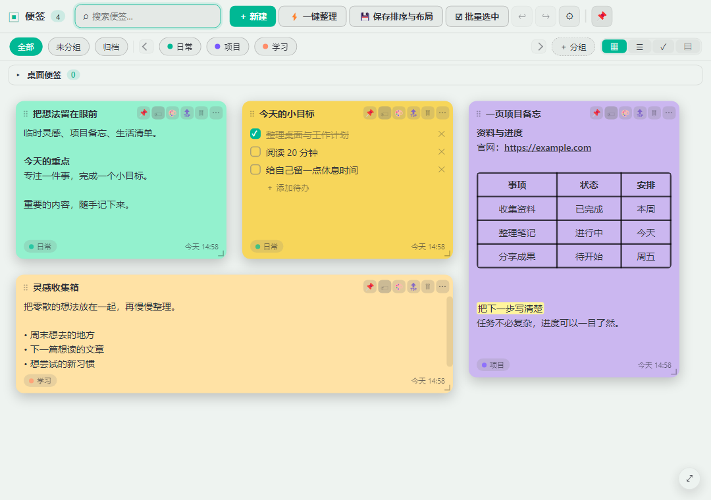
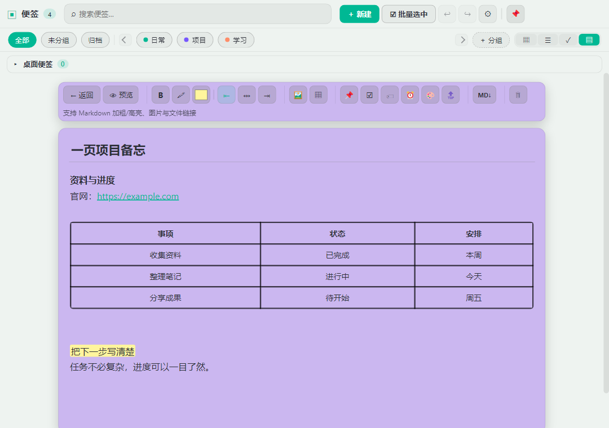

# 📝 便签 MyNotes

> 一款本地优先的 Windows 桌面便签：随手快速记录，也能在画布上整理、管理待办清单，并用文档视图写长内容。
> 数据保存在你自己的电脑上，日常记笔记无需联网、无需账号。

## 📥 下载安装

前往 **[GitHub Releases](https://github.com/LucasRiver9527/Note-Memo/releases)** 下载最新版 `MyNotes-Setup-*.exe` 安装包，双击安装即可，**无需安装 Node.js 等任何环境**，可选择安装目录并创建桌面快捷方式。

- 安装包只是程序本身；你的便签数据保存在系统的**用户数据目录**（不是安装目录），日常使用与升级时保持独立。
- 升级或卸载前，建议先在设置的备份页**导出备份**，以便随时恢复或迁移。
- 离线记录笔记不需要联网、不需要登录账号。手动「检查更新」和点击便签里的外链需要网络。

> 以下为当前源码的虚构演示内容，下载版界面与功能以对应 Release 为准。

## 🖼️ 看看它长什么样



## 🗒️ 视图与画布操作

| 视图 | 适合场景 |
| --- | --- |
| 便签画布 | 便签像卡片铺在画布上，拖动摆放/调整大小，适合自由排布与总览 |
| 备忘录列表 | 适合集中浏览、排序与快速检索多条便签 |
| 待办区 | 集中查看所有待办任务与提醒 |
| 文档视图 | 把便签当长文档排版阅读与编辑 |

- **画布缩放 / 平移**：`Ctrl+滚轮` 以光标为锚缩放，右下角工具栏一键回到 100%；平移时按住**空格并拖动鼠标左键**（非输入编辑状态），或**按住鼠标中键拖动**。
- **分组与搜索**：用颜色分组归类，顶部芯片快速筛选、可折叠整组；搜索框输入关键词即可定位。
- **框选与批量**：空白处拖出选框多选，配合批量删除 / 移动到分组 / 整组拖动。
- **归档**：暂时不用的便签可归档移出常规视图，随时在「归档」入口查看与恢复。
- **一键整理**：按当前顺序紧凑排列当前可见便签；**保存当前排序**记录当时的顺序与布局；需要回到保存的位置时，用设置里的「恢复保存布局」（一键整理本身不执行恢复）。
- **撤销 / 重做**：新建、删除、移动、分组、整理等结构操作可撤销重做。

## ✅ 待办清单


- 便签可切换为**待办清单**，逐条添加、编辑与勾选完成。
- 待办区集中查看全部待办任务与提醒，一眼掌握进度。
- 可为便签或待办设置**提醒时间**，到点弹出系统通知并闪烁主窗口；提醒可播放自定义声音，也能「稍后再响」（延后 5 / 10 / 30 分钟）。
- 提醒需要应用正在运行；电脑休眠/关机可能影响按时提醒。

## 📄 文档视图与 Markdown 导出



- **文档式阅读编辑**：把便签当作长文档排版查看和编辑。
- 支持**常用 Markdown 格式的子集**（**并非完整 Markdown 兼容**）：加粗 `Ctrl+B`、高亮 `Ctrl+H`、图片与文件链接、表格，以及应用自己的文本对齐等排版功能。
- **预览**：一键切换为只读预览，直接看到渲染效果。
- **导出 Markdown**：在文档视图的工具栏按钮，或便签右键菜单的「导出为 Markdown」，便于在其他软件继续编辑；但**不能保证本应用的所有排版/格式在别的软件里都还原一致**（例如本应用自定义的高亮、可编辑表格、斜线表头等）。

## 🪟 独立桌面便签


- 把便签**钉在桌面**，变成始终可见的置顶小窗口，随时速记。
- 支持拖动、调整窗口大小与透明度；可启用 Windows **亚克力磨砂**效果。
- 主窗口常驻**系统托盘**，最小化不占任务栏，点击托盘图标显示 / 隐藏。

## 📊 便签内表格与媒体

- 自研轻量表格，直接在便签里插入：增删行列、单元格合并 / 拆分、**斜线表头**（可编辑两侧文字）。
- 双击单元格编辑，可设边框颜色 / 粗细与文字样式。
- **图片与文件**：编辑区内可粘贴或选择本地图片（按光标位置插入、可拖拽调整大小）；支持拖入文件 / 文件夹生成可点击链接，便于把本地资料与便签关联。

## 🎨 外观定制

- 多款预设主题 + 自定义主题，明暗模式（跟随主题 / 浅色 / 深色）。
- **强调色**、**画布背景**（纯色或本地图片，填充 / 适应 / 拉伸 / 平铺 / 居中）。
- 便签的**圆角、阴影、边框、字距、颜色、字体**可统一调整。
- **顶栏与菜单支持透明度与亚克力模糊**，可自定义底色与透明度。
- **设置入口**：右上角 **⚙ 全局设置**里可调整主题、字体、排序、备份、语言与开机自启动等偏好。
- **中英双语**一键切换。

## 💾 数据与备份

- **本地存储**：数据保存在用户目录，日常使用无需联网。
- **备份**：一键导出为文件夹包，自动携带图片 / 字体 / 声音等媒体；导入备份可快速恢复或迁移（设置 → 备份页）。
- **导出 Markdown**：文档视图工具栏按钮或便签右键菜单的「导出为 Markdown」，单篇导出为文本（见上节说明）。
- **回收站**：删除的便签可恢复，超期自动清理。
- **数据加固**：使用原子写入与 `.bak` 回退降低写入损坏风险；重要内容建议定期备份。

## ⌨️ 常用默认快捷键

| 操作 | 默认快捷键 |
| --- | --- |
| 唤起 / 隐藏主窗口（全局） | `Ctrl+Shift+M` |
| 新建便签（全局） | `Ctrl+Shift+N` |
| 撤销 / 重做（结构操作） | `Ctrl+Z` / `Ctrl+Shift+Z` |
| 加粗 / 高亮（编辑器） | `Ctrl+B` / `Ctrl+H` |
| 左 / 中 / 右对齐（编辑器） | `Ctrl+L` / `Ctrl+E` / `Ctrl+R` |
| 复制选中的便签内图片 | `Ctrl+C` |

以上均可在设置的「快捷键」页改键或恢复默认。

## 🔧 开发者

> 以下供参与开发 / 构建参考，日常使用无需理会。

**环境**：Windows + Node.js（Electron 应用，端到端测试使用 Playwright）。

```bash
npm ci               # 按 package-lock.json 安装依赖（存在 lock 文件）
npm start            # 本地运行
npm run typecheck    # 类型检查
npm test             # 单元测试（Node 内置测试框架）
npm run test:e2e     # 端到端测试（Playwright）
npm run dist         # 打包生成安装包（输出到 release/）
```

- **技术栈**：Electron 33 · electron-builder 25 · electron-updater 6 · Playwright · 原生 HTML / CSS / JS。
- **版本管理**：应用内版本由主进程 `app.getVersion()` 注入；升级版本时需同步 `package.json` 与 `package-lock.json` 中的版本字段（**不要只改 `package.json`**）。
- **自动更新**：通过 `electron-updater` 对接 GitHub Releases（`package.json` 的 `build.publish` 已配置），走稳定通道。发布正式版与预发布版的方式不同，具体以发布时的配置为准。

## 📄 更新日志

详见 [CHANGELOG.md](./CHANGELOG.md)。
